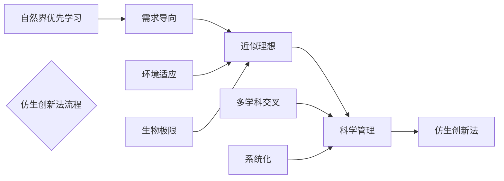

# Learn Markdown syntax

# 一级标题

## 二级标题

### 三级标题

#### 四级标题

##### 五级标题

###### 六级标题

真的是    
        电容柜松茸发热功耗
        爹哦给你
        
*斜体文本*
_斜体文本_
**粗体文本**
__粗体文本__
***粗斜体文本***
___粗斜体文本___

给i哦地方就哦多佛尔乖哟点击佛欸哦额。的覅欧国饿哦风格艺人规划v第几个肉里面

​        u否哦为u第一夫人Howe福哦福嫂u分一个的哦返回荣光扫叶光日服额打黑

***

---

___

***

*__~~dauflt~~__*

<u>带下划线文本</u>

这样[^要]

[^要]: zhende

真的是[^这样]吗？

[^这样]: 那样

* 第一项
* 第二项
  - 利好
  - 得很


> 区块引用
>
> 菜鸟
>
> 学的是梦
>
> > first
> >
> > second
> >
> > third
> >
> > > 6
> > >
> > > 7
> > >
> > > 8

> > > 888
>
> 777
>
> > 666

* 第一项

  > > > > e80


`printf()`函数

```python
666
print(a)
```

```python
print(a)
```

```
```

```
```


	666

​	print(9)

这是[广东工业大学网址](https://www.gdut.edu.cn/)

<https://www.gdut.edu.cn/>

这个链接用1作为网址变量 [Google][1]
这个链接用runoob作为网址变量 [Runoob][runoob]

http://www.google.com/

http://www.runoob.com/


这个链接用 1 作为网址变量 [RUNOOB][1].

http://static.runoob.com/images/runoob-logo.png

| 星期一 | 星期三 | 星期五 | 星期二 | 星期四 | 星期六 | 星期日 |
| :----: | :----: | :----: | :----: | :----: | :----: | :----: |
|  666   |  777   |  888   |  999   |  000   |  111   |  555   |
|   1    |   2    |   3    |   4    |   5    |   6    |   7    |

H<sub>2</sub>O

100<sup>2</sup>

我<em>真的</em>不知道

<kbd>Ctrl</kbd>+<kbd>Alt</kbd>+<kbd>Del</kbd> 重启电脑
\*\* 正常显示星号 \*\*



~~~sequence
```sequence
对象A->对象B: 对象B你好吗?（请求）
Note right of 对象B: 对象B的描述
Note left of 对象A: 对象A的描述(提示)
对象B-->对象A: 我很好(响应)
对象A->对象B: 你真的好吗？
```
~~~

```flow
st=>start: 开始
cond1=>condition: if
cond2=>condition: elif
cond...=>condition: ...
condn=>condition: else
io1=>inputoutput: 代码块1
io2=>inputoutput: 代码块2
io...=>inputoutput: 代码块...
ion=>inputoutput: 代码块n
e=>end: 结束
st->cond1
cond1(yes)->io1
cond1(no)->cond2
cond2(yes)->io2
cond2(no)->cond...
cond...(yes)->io...
cond...(no)->condn
condn(yes)->ion
ion->e
io...->e
io2->e
io1->e
```

